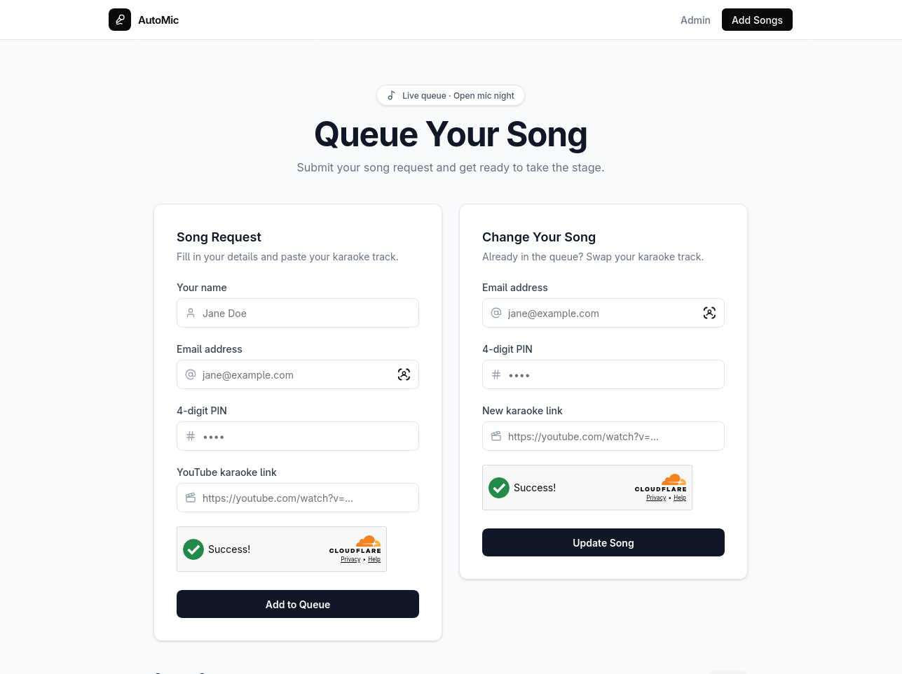
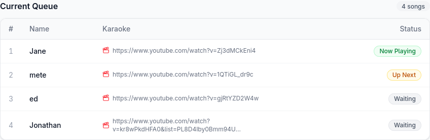
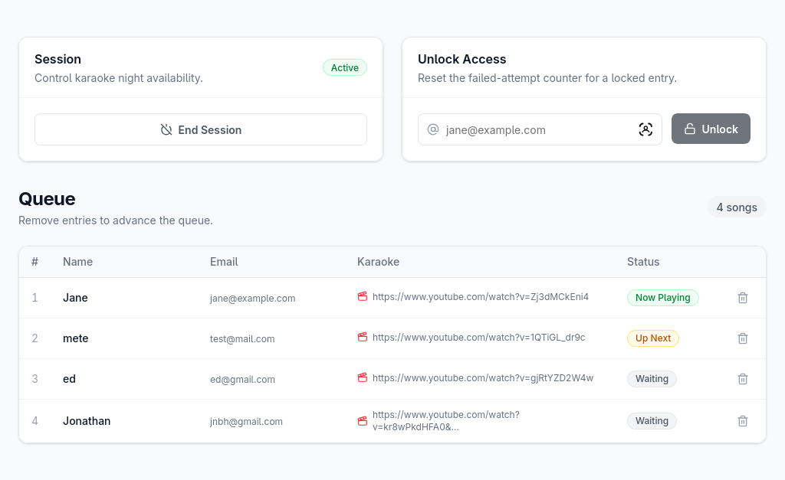

# AutoMic 🎤

> A real-time karaoke queue manager built for the stage — not the spreadsheet.

**Live:** [automic.metetolgag.workers.dev](https://automic.metetolgag.workers.dev)

---



AutoMic is a lightweight karaoke queue system. Guests drop a YouTube link, their name, and a 4-digit PIN to claim their spot. The host sees the full queue in the admin panel, clicks a song to open it and auto-remove the entry, and keeps the night moving without ever touching a keyboard.

---

## ✨ Features

- **Song requests** — guests paste a YouTube link, name, and PIN to join the queue
- **Live queue view** — see who's up next and what's playing, updating in real-time
- **Cooldown enforcement** — 25-minute cooldown per email address, enforced server-side
- **PIN-protected edits** — guests can swap their link before their turn; 3 wrong attempts lock the entry
- **Admin dashboard** — one-click to open a song in a new window and remove it from the queue simultaneously
- **Session control** — host opens and closes karaoke night; closing wipes the queue automatically
- **Spam protection** — Cloudflare Turnstile on every submission
- **Unlock tool** — admin can clear a locked-out entry from the dashboard

---

## 📸 Screenshots

| Queue (Guest view) | Admin Dashboard |
|---|---|
|  |  |

---

## 🛠️ Tech Stack

| Layer | Technology |
|---|---|
| Framework | [TanStack Start](https://tanstack.com/start) (React + SSR) |
| Deployment | [Cloudflare Workers](https://workers.cloudflare.com/) |
| Database | [Supabase](https://supabase.com/) (PostgreSQL + Realtime) |
| Styling | [Tailwind CSS v4](https://tailwindcss.com/) |
| Auth | Supabase Auth (admin only) |
| Bot protection | [Cloudflare Turnstile](https://developers.cloudflare.com/turnstile/) |

---

## 🚀 Getting Started

> **Currently in active development and only deployed for [Händelbar](https://www.instagram.com/handelbar.hh/) — the Student Bar at Händelwohnheim, Freiburg im Breisgau.**
>
> This is not a general-purpose SaaS product. If you want to run your own instance, you'll need to wire up your own Supabase project, Cloudflare account, and Turnstile keys.

### Prerequisites

- Node.js 18+
- A [Supabase](https://supabase.com) project
- A [Cloudflare](https://cloudflare.com) account with Workers and Turnstile enabled

### 1. Clone

```bash
git clone git@github.com:metetolga/AutoMic.git
cd AutoMic
```

### 2. Install dependencies

```bash
npm install
```

### 3. Configure environment variables

Create a `.env` file in the project root (already in `.gitignore`):

```env
VITE_SUPABASE_URL=https://your-project.supabase.co
VITE_SUPABASE_KEY=your-anon-public-key
```

Create a `.dev.vars` file for Cloudflare Workers local runtime (also in `.gitignore`):

```env
VITE_SUPABASE_URL=https://your-project.supabase.co
VITE_SUPABASE_KEY=your-anon-public-key
SUPABASE_SERVICE_ROLE_KEY=your-service-role-key
TURNSTILE_SITE_KEY=your-turnstile-site-key
TURNSTILE_SECRET_KEY=your-turnstile-secret-key
```

Add the same variables (except the `VITE_` ones) to your Cloudflare Workers build dashboard for production.

Also put secret keys to wrangler with:
```
npx wrangler secret put TURNSTILE_SECRET_KEY
npx wrangler secret put SUPABASE_SERVICE_ROLE_KEY
```

### 4. Run locally

```bash
npm run dev
```

### 5. Deploy

```bash
npm run deploy
```

---

## 📁 Project Structure

```
src/
  routes/
    __root.tsx        # HTML shell, head tags
    index.tsx         # Guest queue page
    admin/
      index.tsx       # Admin dashboard
      login.tsx       # Admin login
  lib/
    queue.functions.ts  # Server functions (add, update, unlock, session)
    supabase.ts         # Browser Supabase client (lazy)
    supabase.auth.ts    # Browser auth client
```

---

## License

**MIT with Attribution** — you are free to use, modify, fork, and build your own version of AutoMic for any purpose, including commercial. The only condition: if you ship something built on this codebase, you must include a visible credit linking back to the original project ([github.com/metetolga/AutoMic](https://github.com/metetolga/AutoMic)).

See [LICENSE](LICENSE) for the full text.
